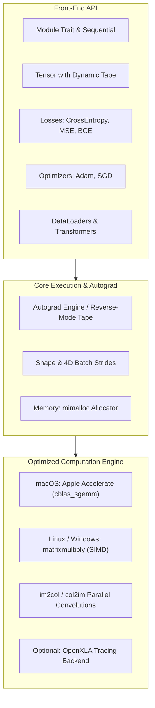

# Rensor (NeuralFlow)

[]()
[](https://opensource.org/licenses/Apache-2.0)
[]()
[]()

**Rensor** (NeuralFlow) is a native, high-performance deep learning framework built in Rust, engineered from the ground up for maximum CPU training and inference efficiency. It combines a dynamic computational graph, reverse-mode automatic differentiation (autograd), high-speed hardware-accelerated BLAS backends, and an ergonomic, PyTorch-like API with zero Python interpreter overhead.

---

## Key Features

- **Blazing Fast CPU Engine**:
  - Hardware-accelerated matrix multiplication using Apple's **Accelerate framework** (`cblas_sgemm`) on macOS and **`matrixmultiply`** with AVX/FMA/NEON SIMD on Linux & Windows.
  - Efficient GEMM-based 2D convolutions using optimized parallel `im2col` and `col2im` transformations.
  - Contiguous buffer layout with minimal dynamic reallocation and **`mimalloc`** as the global allocator.
- **Dynamic Autograd Tape**:
  - PyTorch-style reverse-mode automatic differentiation with fine-grained gradient tracking.
  - Context-managed gradient computation controls (`no_grad()`, `is_grad_enabled()`, `NoGradGuard`).
- **Comprehensive Layer & Activation Suite**:
  - **Layers**: `Linear`, `Conv2d`, `MaxPool2d`, `AvgPool2d`, `Flatten`, `LayerNorm`, `Dropout`.
  - **Activations**: `ReLu`, `LeakyReLu`, `Sigmoid`, `Tanh`.
  - **Containers**: Modular `Module` trait and `Sequential` container for flexible composition.
- **Numerically Stable Loss Functions**:
  - `cross_entropy_loss` with LogSumExp stabilization (supports class index and one-hot targets).
  - `mse_loss`, `bce_loss`, and `bce_with_logits_loss`.
- **First-Class Optimizers**:
  - `Adam` (with first/second moment tracking, bias correction, weight decay).
  - `SGD` (with momentum support).
- **Data Preprocessing & Loading Pipelines**:
  - `TensorDataset`, `CsvDataset` (direct CSV ingestion).
  - Parallel-ready `Dataloader` with mini-batching and dynamic shuffling.
  - `StandardScaler` (z-score feature normalization), `train_test_split`, `train_val_test_split`, and `KFold` cross-validation.
- **Model Checkpointing & Evaluation**:
  - Automated evaluation harness (`Evaluator`) generating comprehensive `EvaluationReport` (MAE, MSE, RMSE, R², Accuracy).
  - Binary checkpoint saving/loading via `serde` and `bincode` with automated best-model tracking (`BestModelSaver`).
- **Extensible Backend**:
  - Optional OpenXLA computational graph tracing backend (`xla` feature flag) for compiled graph execution.

---

## Benchmark: MNIST CNN Training & Throughput

To evaluate raw CPU performance against industry standards, a full end-to-end Convolutional Neural Network was trained on the complete MNIST dataset (60,000 training images, 10,000 testing images) across 20 epochs.

### Benchmark Setup

- **Model Architecture**:
  - `Conv2d(1 -> 16, kernel=3x3, stride=1, padding=1)` + `ReLU` + `MaxPool2d(2x2)`
  - `Conv2d(16 -> 32, kernel=3x3, stride=1, padding=1)` + `ReLU` + `MaxPool2d(2x2)`
  - `Flatten` + `Linear(1568 -> 128)` + `ReLU` + `Dropout(0.2)` + `Linear(128 -> 10)`
  - **Trainable Parameters**: 206,784
- **Hyperparameters**:
  - Batch Size: `128` | Epochs: `20` | Optimizer: `Adam (lr=0.001)` | Loss: `CrossEntropyLoss`
- **Environment**: Apple Silicon CPU (macOS, Accelerate BLAS vs. PyTorch CPU backend).

### Performance Results

| Metric | Rensor (`target/release/examples/CNN`) | PyTorch CPU (`examples/cnn_benchmark.py`) | Advantage |
| :--- | :---: | :---: | :---: |
| **Peak Throughput** | **11,208.4 img/s** | **7,395.8 img/s** | **~1.52x faster** |
| **Average Throughput** | **10,050+ img/s** | **~7,200 img/s** | **~1.40x faster** |
| **Total Runtime (20 Epochs)** | **122.62 s** | **~175 s** | **~30% less time** |
| **Peak Test Accuracy** | **99.18%** (Epoch 14) | **99.10%** | Comparable convergence |
| **Dataset Loading Time** | **0.11 s** (60k + 10k samples) | **0.10 s** | Instantaneous |

### Epoch-by-Epoch Convergence (Rensor)

```text
============================================================
  NeuralFlow: MNIST CNN Training & Benchmark
============================================================

Loading MNIST dataset...
Loaded 60000 train samples, 10000 test samples in 0.11s
Model initialized with 206784 trainable parameters
Optimizer: Adam (lr=0.001) | Loss: CrossEntropyLoss
Batch size: 128 | Epochs: 20

---------------------------------------------------------------------------
Epoch  | Train Loss | Train Acc | Val Loss   | Val Acc  | Throughput  
---------------------------------------------------------------------------
1/20   | 0.2132     | 93.57   % | 0.0646     | 97.77  % | 9649.1  img/s
2/20   | 0.0667     | 97.97   % | 0.0425     | 98.63  % | 10018.1 img/s
3/20   | 0.0466     | 98.54   % | 0.0360     | 98.86  % | 10193.2 img/s
4/20   | 0.0357     | 98.84   % | 0.0330     | 98.95  % | 10137.2 img/s
5/20   | 0.0292     | 99.08   % | 0.0324     | 98.96  % | 9951.7  img/s
6/20   | 0.0238     | 99.24   % | 0.0324     | 98.96  % | 10264.5 img/s
7/20   | 0.0204     | 99.37   % | 0.0321     | 98.99  % | 10163.4 img/s
8/20   | 0.0173     | 99.44   % | 0.0266     | 99.07  % | 10801.8 img/s
9/20   | 0.0155     | 99.53   % | 0.0286     | 99.02  % | 10121.8 img/s
10/20  | 0.0124     | 99.57   % | 0.0311     | 99.03  % | 10804.1 img/s
11/20  | 0.0119     | 99.61   % | 0.0340     | 98.92  % | 10824.1 img/s
12/20  | 0.0100     | 99.65   % | 0.0306     | 98.97  % | 9334.9  img/s
13/20  | 0.0101     | 99.67   % | 0.0357     | 99.04  % | 10234.5 img/s
14/20  | 0.0087     | 99.72   % | 0.0330     | 99.18  % | 10141.5 img/s
15/20  | 0.0069     | 99.77   % | 0.0322     | 99.14  % | 9440.4  img/s
16/20  | 0.0076     | 99.75   % | 0.0344     | 99.13  % | 9099.2  img/s
17/20  | 0.0075     | 99.75   % | 0.0336     | 99.13  % | 9491.3  img/s
18/20  | 0.0062     | 99.79   % | 0.0357     | 99.09  % | 10070.1 img/s
19/20  | 0.0062     | 99.80   % | 0.0343     | 99.13  % | 11087.7 img/s
20/20  | 0.0056     | 99.79   % | 0.0373     | 99.03  % | 11208.4 img/s
---------------------------------------------------------------------------
Benchmark completed in 122.62s
```

---

## Installation

Add `rensor` to your `Cargo.toml`:

```toml
[dependencies]
rensor = { git = "https://github.com/TETRAWasTaken/NeuralFlow.git" }
```

For maximum performance, ensure release builds enable Link-Time Optimization (LTO):

```toml
[profile.release]
opt-level = 3
lto = "fat"
codegen-units = 1
panic = "abort"
```

---

## Quickstart & Code Examples

### 1. Training a Convolutional Neural Network (CNN)

```rust
use rensor::prelude::*;

fn main() {
    // 1. Compose model with Sequential container
    let model = Sequential::new(vec![
        // Block 1: (N, 1, 28, 28) -> (N, 16, 14, 14)
        Box::new(Conv2d::new_with_options(1, 16, (3, 3), (1, 1), (1, 1), true)),
        Box::new(ReLu),
        Box::new(MaxPool2d::new((2, 2))),
        
        // Block 2: (N, 16, 14, 14) -> (N, 32, 7, 7)
        Box::new(Conv2d::new_with_options(16, 32, (3, 3), (1, 1), (1, 1), true)),
        Box::new(ReLu),
        Box::new(MaxPool2d::new((2, 2))),
        
        // Classifier: (N, 32 * 7 * 7) -> (N, 10)
        Box::new(Flatten::new()),
        Box::new(Linear::new(32 * 7 * 7, 128)),
        Box::new(ReLu),
        Box::new(Dropout::new(0.2)),
        Box::new(Linear::new(128, 10)),
    ]);

    let mut optimizer = Adam::new(0.001, 0.9, 0.999, 1e-8, 0.0);

    // Dummy batch: batch_size=4, channels=1, height=28, width=28
    let x_batch = Tensor::new_4d(vec![0.5; 4 * 1 * 28 * 28], (4, 1, 28, 28));
    let targets = Tensor::new(vec![0.0, 1.0, 4.0, 9.0], (4, 1));

    model.train();
    model.zero_grad();

    let logits = model.forward(&x_batch);
    let loss = cross_entropy_loss(&logits, &targets);

    loss.backward();
    optimizer.step(&model.parameters());

    println!("Batch Loss: {:.4}", loss.0.borrow().data[0]);
}
```

### 2. Custom Module with LayerNorm, Dropout, and Checkpointing

```rust
use rensor::prelude::*;
use std::collections::HashMap;

pub struct DeepRegressionNet {
    fc1: Linear,
    ln1: LayerNorm,
    drop: Dropout,
    fc2: Linear,
}

impl DeepRegressionNet {
    pub fn new(in_dim: usize, hidden_dim: usize, out_dim: usize) -> Self {
        Self {
            fc1: Linear::new(in_dim, hidden_dim),
            ln1: LayerNorm::new(hidden_dim),
            drop: Dropout::new(0.2),
            fc2: Linear::new(hidden_dim, out_dim),
        }
    }
}

impl Module for DeepRegressionNet {
    fn forward(&self, x: &Tensor) -> Tensor {
        let h = self.fc1.forward(x);
        let h = self.ln1.forward(&h);
        let h = self.drop.forward(&h).relu();
        self.fc2.forward(&h)
    }

    fn parameters(&self) -> Vec<Tensor> {
        let mut p = self.fc1.parameters();
        p.extend(self.ln1.parameters());
        p.extend(self.drop.parameters());
        p.extend(self.fc2.parameters());
        p
    }
}

fn main() -> Result<(), Box<dyn std::error::Error>> {
    let model = DeepRegressionNet::new(8, 32, 1);
    let mut optimizer = Adam::new(0.005, 0.9, 0.999, 1e-8, 0.0);
    let mut best_saver = BestModelSaver::new("best_checkpoint.bin");

    // Training loop
    model.train();
    for epoch in 1..=10 {
        let inputs = Tensor::new(vec![0.5; 16 * 8], (16, 8));
        let targets = Tensor::new(vec![1.0; 16 * 1], (16, 1));

        model.zero_grad();
        let preds = model.forward(&inputs);
        let loss = mse_loss(&preds, &targets);

        loss.backward();
        optimizer.step(&model.parameters());

        let loss_val = loss.0.borrow().data[0];
        
        // Track and save the best model weights automatically
        let mut metrics = HashMap::new();
        metrics.insert("val_loss".to_string(), loss_val);
        best_saver.check_and_save(&model, epoch, loss_val, metrics);
    }

    // Load saved checkpoint
    let mut loaded_model = DeepRegressionNet::new(8, 32, 1);
    let checkpoint = ModelCheckpoint::load(&mut loaded_model, "best_checkpoint.bin")?;
    println!("Loaded checkpoint from epoch {}", checkpoint.epoch);

    Ok(())
}
```

### 3. CSV Dataset Ingestion, Normalization & Evaluation

```rust
use rensor::prelude::*;

fn main() -> Result<(), Box<dyn std::error::Error>> {
    // 1. Ingest tabular data directly from CSV (target column index = 8)
    let dataset = CsvDataset::from_file("examples/housing.csv", 8, true)?;
    
    // 2. Perform reproducible train/test split
    let (train_data, test_data) = train_test_split(&dataset, 0.2, true);

    // 3. Create parallel-ready mini-batch DataLoaders
    let mut train_loader = Dataloader::new(&train_data, 64, true);
    let mut test_loader = Dataloader::new(&test_data, 64, false);

    // 4. Build a sequential network
    let model = Sequential::new(vec![
        Box::new(Linear::new(9, 32)),
        Box::new(ReLu),
        Box::new(Linear::new(32, 1)),
    ]);

    // 5. Evaluate using the automated evaluation harness
    let report = Evaluator::evaluate(&model, &mut test_loader, mse_loss);
    println!("Evaluation: {}", report);
    // Outputs: Loss, MAE, MSE, RMSE, R² Score

    Ok(())
}
```

---

## Architecture Overview



---

## Running Examples & Tests

### Run Unit and Integration Tests

```bash
cargo test
```

### Run MNIST CNN Benchmark (Release Mode)

```bash
cargo run --example CNN --release
```

### Run California Housing Deep MLP (with Checkpoint Saver)

```bash
cargo run --example deepnetwork --release
```

### Run PyTorch Comparison Benchmark (Requires Python & PyTorch)

```bash
python examples/cnn_benchmark.py
```

---

## Contributing & License

Contributions are welcome! Please feel free to submit pull requests or file issues for feature requests and bug reports.

Licensed under the [Apache License, Version 2.0](LICENSE).
